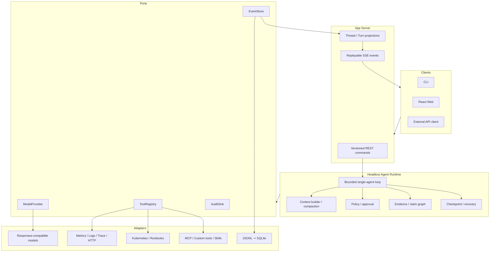
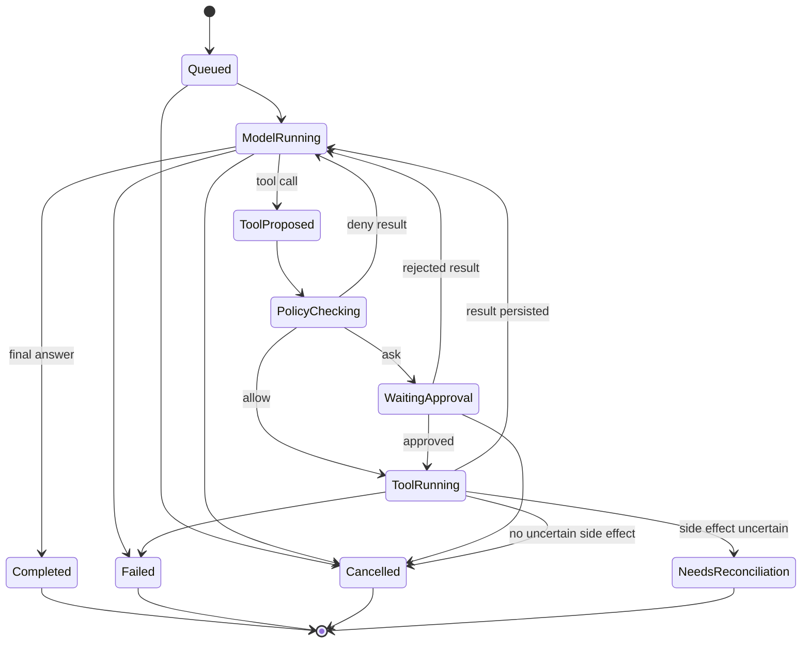

# OpsCodex 目标架构

- 状态：Approved baseline
- 适用范围：`v0.1` 至 `v1.0`

## 架构总览



Runtime 不依赖 React、Axum DTO、供应商 wire type 或具体存储后端。App Server 将外部命令
映射为 Runtime command，并把领域事件投影为 REST 资源和 SSE 流。

## 领域层级

```text
Workspace
  Thread
    Turn
      Item
      Evidence
      Claim
      Approval / Action
```

- `Workspace`：目标环境、能力、凭据引用和 Policy 的信任边界。
- `Thread`：围绕一个事故持续发展的调查上下文，只属于一个 Workspace。
- `Turn`：一个用户意图触发的有界执行；同一 Thread 最多一个 active Turn。
- `Item`：有稳定 ID 的语义内容，例如消息、工具调用、工具结果和摘要。
- `Event`：带顺序的不可变通知，不等同于 Item；分为权威 Domain Event 和可压缩 Delivery Event。
- `Evidence`：从工具结果规范化出的可引用事实。
- `Claim`：诊断输出中的陈述，必须标注 `observed`、`inferred` 或 `recommended`。
- `Action`：改变环境的结构化操作，只能进入受控 remediation 生命周期。

`v0.1` 没有显式 Workspace，默认映射到 `default`。引入 Workspace 时必须保持旧 Thread 可读。

## 核心不变量

1. Event 在广播给客户端前必须先成功持久化。
2. 每个 Thread 的 `seq` 单调递增；SSE 是 at-least-once，客户端按 `(thread_id, seq)` 去重。
3. 一个 Turn 恰好进入 `completed`、`failed`、`cancelled` 或 `needs_reconciliation` 一个终态。
4. 同一 Thread 同时最多一个 active Turn；不同 Thread 受 Workspace 和全局预算限制。
5. Tool proposal、authorization、execution start 和 result 是不同状态，审批前不能声称已执行。
6. Tool call 与 result 必须配对后才能进入模型上下文；不完整调用不能伪造成成功证据。
7. Tool failure 作为结构化结果回灌模型，除非错误使整个 Runtime 无法继续。
8. 关键诊断 Claim 必须引用 Evidence ID；Evidence 内容不可在引用后静默替换。
9. 模型提示词不是安全边界。Target、Effect、Policy、Approval 和 Sandbox 由代码强制。
10. Chain of Thought 不成为 Item、Event、Evidence、telemetry 或 API 字段。

Domain Event 是状态重建的事实源。Assistant token delta、进度和 heartbeat 属于 Delivery Event：
它们同样先持久化再广播以支持正在执行时重连，但不能单独生成完成消息或诊断事实。完成 Item
持久化并超过兼容 retention 后可以清理 Delivery payload，原 `seq` 永不复用，投影仍由完成 Item
和 Domain Event 确定性重建。

## Turn 状态机



只读工具可以在稳定 operation ID 下重试。写工具若已开始但结果未持久化，必须进入
`NeedsReconciliation`，由用户确认实际状态后再继续，不能自动重复执行。

## 一次调查的数据流

1. 客户端创建或选择 Thread，并提交用户输入和可选 Incident Context。
2. Server 校验 Workspace、输入预算和同 Thread 并发，持久化 command acceptance。
3. Runtime 从最后一个 checkpoint 构建上下文，只包含完成消息、成对工具交互、Evidence 引用和
   必需摘要。
4. ModelProvider 把内部请求映射为供应商协议，流式 delta 作为 delivery event 输出。
5. Tool call 先规范化参数和目标，再由 Policy 根据 effect、scope 和本地规则决策。
6. 工具输出先经过边界限制、脱敏和 Evidence 规范化，再持久化并回灌模型。
7. 没有后续 Tool call 时，Runtime 校验最终答案结构和引用，写入终态。
8. Server 从 EventStore 回放后切换到 live stream；客户端仅维护事件投影。

## 模型边界

`ModelProvider` 使用项目自有类型：

```rust
#[async_trait]
trait ModelProvider: Send + Sync {
    fn capabilities(&self) -> ModelCapabilities;

    async fn complete(
        &self,
        request: ModelRequest,
        sink: ModelEventSink,
        cancellation: CancellationToken,
    ) -> Result<ModelResponse>;
}
```

Provider capability 至少声明 streaming、tool calls、parallel calls、usage、reasoning control、
continuation 和 request idempotency。所谓 Responses-compatible endpoint 仍必须通过统一契约测试；
兼容性按行为而不是供应商品牌判断。

供应商若要求 opaque continuation token，只能作为敏感 Provider checkpoint 保存，不得作为普通
Item、日志或 UI 内容。无法安全恢复时，从最后一个规范化模型步骤重新开始。

## Tool 与 Policy 边界

目标 Tool descriptor：

```text
identity: namespace/name@version
input_schema / output_schema
effect: observe | change_reversible | change_irreversible | external_side_effect
targets: required capabilities and scopes
budgets: timeout, bytes, rows, calls
recovery: retryable, idempotency support, reconciliation method
provenance: builtin | mcp | custom
```

Policy 使用规范化参数和解析后的目标决策，不能只看工具名。远程地址需要 DNS 解析后再次核对
allowlist；凭据按引用注入，不能出现在模型输入、工具参数、Event 或日志中。

`exec` 保留为本地开发 escape hatch：默认关闭、每次审批、不参与 `v0.6` 安全 remediation
保证。生产安全配置必须禁用它。

## Evidence 与 Claim

目标 Evidence 结构至少包含：

```text
evidence_id
workspace_id / thread_id / turn_id / tool_call_id
source_kind / source_ref
query_or_operation
observed_at / time_range
summary / artifact_ref
content_type / byte_size / truncated
sensitivity
sha256
```

大输出保存在有界 artifact 中，模型上下文只引用摘要和稳定 ID。最终 Diagnosis 结构包含 Claim：

```text
claim_id
kind: observed | inferred | recommended
statement
evidence_ids[]
confidence: low | medium | high
```

置信度是分级判断，不伪装为未经校准的精确概率。

## Context 策略

`v0.1` 的 item-count 裁剪演进为多预算 Context Builder：token、bytes、tool calls、Evidence 和成本。
优先级固定为：当前用户输入 > 未完成调用配对 > 关键 Evidence > 最近完成消息 > 摘要。

Compaction 产生带覆盖 `seq` 范围、输入哈希和模型版本的 Summary Item，不能删除原始事实。
Thread fork 从一个已持久化 `seq` 创建子 Thread，并记录 parent pointer 与继承的 compaction。

## 存储和恢复

- `v0.1`：每 Thread append-only JSONL，是领域事件事实源。
- `v0.2-v0.4`：先引入 `EventStore` 端口、schema version 和投影契约，仍使用 JSONL。
- `v0.5`：SQLite WAL 成为默认事实源，事务内写 Event、checkpoint、approval 和 lease；JSONL
  保留为导入导出格式。
- 托管多租户数据库、消息队列和分布式 lease 不在 `v1.0` 范围内。

投影可以重建，不能成为唯一事实源。迁移必须保留 Thread ID、Event ID、`seq`、时间戳和哈希。

## 外部协议

- 所有新接口放在 `/api/v1`；`v0.1` 无版本路由在兼容窗口内保留。
- 命令支持 `Idempotency-Key`，重复请求返回原 operation，而不是重复启动 Turn 或 Action。
- SSE EventEnvelope 包含 `schema_version`、`stream_kind`、`event_id`、`seq`、
  Workspace/Thread/Turn/Item/causation ID。
- 未知可选字段必须忽略；未知事件类型必须保留游标并提示客户端升级。
- 列表和历史接口必须分页；大 Evidence 使用单独的有界 artifact endpoint。

## 自身可观测性和隐私

OpsCodex 区分三条数据面：

1. Product Event：用于重建 Thread 和客户端投影。
2. Runtime telemetry：延迟、错误、队列、token、存储和 SSE lag，不含原始 Evidence。
3. Security audit：策略输入摘要、批准、动作和校验结果，按保留策略存储。

Span 层级为 `thread -> turn -> model/tool/policy/store`。高基数字段不能进入 metric label。Prompt、
工具原始参数/输出、Secret 和个人数据默认不进入 telemetry。

## 部署边界

`v1.0` 默认仍是 modular monolith：一个 Rust 进程托管 Runtime、REST/SSE 和静态 React。
SQLite 和本地 artifact 目录由同一进程拥有。CLI 可以直接嵌入 Runtime；Web 和外部客户端经
App Server 使用相同领域语义。

未配置认证和 TLS 时，Server 必须拒绝绑定非 loopback 地址。远程多用户部署需要新的产品目标，
不能通过修改 `host=0.0.0.0` 绕过边界。
