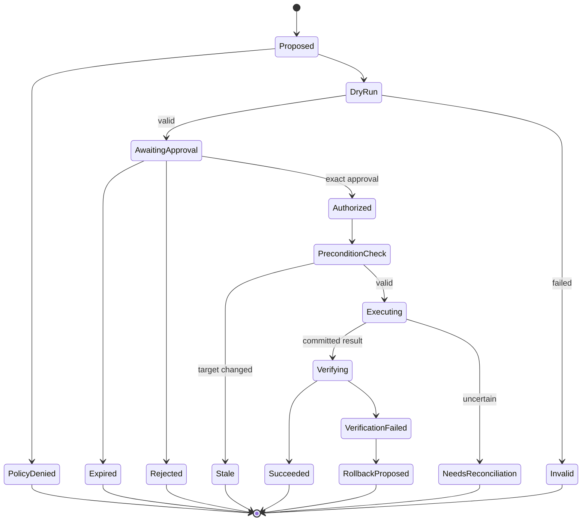

# v0.6 详细设计：Safe Remediation

- 状态：实现中
- 前置条件：`v0.5` 恢复、持久审批和 reconciliation 门禁通过

## 阶段目标

在默认只读不变的前提下，为少量结构化、范围明确、可验证的操作提供安全 remediation。
模型只能提出 ActionPlan；Policy 和用户批准后，独立执行器才可以改变环境。

## 用户结果

Agent 在完成证据化诊断后可以提出一个具体修复计划，展示目标、前置条件、预期影响、dry-run、
验证方法和回退方法。用户批准的内容与实际执行内容字节级绑定。执行后 Agent 收集新 Evidence
验证恢复；状态不确定时停止并请求人工对账。

## 范围

### 包含

- ActionPlan/Action/Operation/Verification/Reconciliation 领域模型。
- 参数级 capability policy、批准 request hash、TTL 和单次 operation ID。
- 独立最小权限 runner、dry-run、kill switch 和并发/范围预算。
- 首批结构化动作：Demo fault reset 与 Kubernetes workload scale。
- 前置条件、幂等键、执行后验证和显式 rollback proposal。
- 持久、hash-chained Security Audit。
- Prompt Injection、越权、重放、TOCTOU 和崩溃安全场景。

### 不包含

- 无人值守自动修复、批量 fleet 操作或定时执行。
- 任意 `exec`、Runbook shell snippet 或 MCP Tool 自动升级为 remediation。
- 自动 rollback；rollback 是新的 Action，需要重新校验和批准。
- 不可逆生产动作，例如 delete namespace、delete database 或 rotate credentials。

## Action 生命周期



模型不能直接从 Proposed 跳到 Executing。每次状态变化必须是 durable Event 和 Audit record。

## ActionPlan 合同

```text
ActionPlan {
  plan_id, workspace_id, thread_id, diagnosis_claim_ids[],
  actions[], created_at, expires_at
}

Action {
  action_id, tool_id/version, effect,
  normalized_target, normalized_parameters,
  preconditions[], expected_effect,
  dry_run_result, verification_spec,
  rollback_spec?, blast_radius,
  operation_id, request_hash
}
```

`request_hash` 覆盖 Workspace、Tool ID/version/schema hash、target、parameters、preconditions、
verification、effect、operation ID 和 expiry。任何字段变化都使批准失效。

## 初始动作

### Demo fault reset

只在 `local-demo` Workspace 注册，把已知 fault mode 设为 `normal`。用于完整验证
plan/approve/execute/verify，不代表生产 HTTP mutation 通用能力。

### Kubernetes workload scale

仅支持 allowlist Deployment/StatefulSet 的 replicas patch：

- Proposed 时读取 UID、resourceVersion、当前 replicas 和健康状态。
- dry-run 使用 Kubernetes dry-run server validation。
- precondition 要求 UID/resourceVersion 和批准时一致，防止 TOCTOU。
- patch 使用 operation annotation/idempotency marker 和最小 field manager。
- verify 检查 desired/updated/available replicas 和 rollout condition。
- rollback proposal 使用原 replicas，但必须重新读取状态和重新批准。

`rollout restart`、delete pod 和任意 patch 不在初始动作集合。

## Policy 与批准

Policy 输入至少包含：operator identity、Workspace、Tool descriptor、effect、normalized target、
parameters、Evidence/Claim、time、budgets 和 existing operations。决策为 deny、ask 或 allow；
`change_*` 在 `v1.0` 前永远不能配置为无需人工的 allow。

本地模式的 operator identity 来自当前 OS user 和一次本地会话标识，只用于绑定批准与审计，
不构成远程用户认证或 RBAC。非 loopback 服务仍不在 `v1.0` 支持范围。

批准记录包含 approver、request hash、operation ID、issued/expiry、decision 和 UI 显示摘要。
批准只能消费一次，不能跨 Workspace、目标、Tool version 或参数复用。拒绝、过期和取消都是终态。

## 执行隔离

- remediation runner 使用与调查 Runtime 分离的最小凭据和 client。
- Workspace 可以全局禁用 change capability；进程级 kill switch 优先于所有批准。
- 每个 Plan 限制 Action 数、目标数、并发和总时长；初始版本只允许单 Action plan。
- Secret 只在执行时按引用解析，不进入 Event、模型 Context 或 Audit payload。
- 所有网络目标在执行前重新解析并校验；Policy 结果不缓存到新地址。

## Verify、Reconcile 与 Rollback

执行成功不等于 remediation 成功。Verification 是一个受限的只读 Evidence collection plan，
比较操作前后指标、工作负载状态和健康条件。

- Verification 通过：Action `succeeded`，生成 before/after Evidence links。
- Verification 失败：`verification_failed`，Agent 可以提出 rollback，但不能自动执行。
- 连接中断且无法确认 commit：`needs_reconciliation`，运行只读 reconciliation probe。
- Probe 仍不确定：停止，不重复写入，要求人工处理。

## Audit

Security Audit 与 Product Event、telemetry 分开。每条记录包含 previous hash、record hash、actor、
Workspace、operation、policy/approval/result 摘要和时间。原始 Secret/Evidence 不进入 Audit；使用
稳定 ID 和 hash 引用。

启动和导出时可验证 hash chain。该机制用于本地篡改检测，不宣称第三方不可抵赖；远程审计服务
不在 `v1.0` 范围内。

## API 与 UI

- Diagnosis 页面只显示“Propose remediation”，不能直接执行 Tool。
- Action review 必须逐字段显示 target、effect、parameters、preconditions、blast radius、expiry、
  dry-run、verification 和 rollback availability。
- Approve API 只接受 approval ID 和显示的 request hash；服务端重新计算并比较。
- UI 不提供“本 Thread 永久允许”或批量批准。
- NeedsReconciliation 使用阻断状态和明确人工步骤，不能显示为普通失败后可重试。

## 实施任务

### Task 1：Action domain 与状态机

- Acceptance：所有转换显式、持久、可恢复；非法跳转拒绝；Plan 引用有效 Diagnosis Claim。
- Verify：state transition/property tests、schema compatibility、expiry tests。
- Files：新增 action domain/events/store projection、tests、docs。

### Task 2：参数级 Policy 与绑定批准

- Acceptance：request hash 覆盖全部安全字段；批准单次、可过期、变化失效、重启可恢复。
- Verify：replay、parameter swap、target swap、version change、cross-workspace tests。
- Files：policy、approval store/API、UI review、tests。

### Task 3：最小权限 remediation runner

- Acceptance：独立 credentials、kill switch、budget、precondition 和 cancellation 完整。
- Verify：credential isolation、timeout、kill switch、DNS/target change、crash tests。
- Files：新增 runner、Workspace config、runtime coordinator、tests、telemetry。

### Task 4：Demo fault reset 垂直切片

- Acceptance：完整 plan/approve/execute/verify 在确定性 Demo 通过，未批准调用为 0。
- Verify：approve/reject/expire/cancel/restart and before-after Evidence scenario。
- Files：Demo action Tool、scenario、UI/CLI、verifier、docs。

### Task 5：Kubernetes scale 垂直切片

- Acceptance：dry-run/resourceVersion/patch/verify/rollback proposal 完整，目标严格 allowlist。
- Verify：fake API TOCTOU、idempotency、partial failure、reconciliation、RBAC tests。
- Files：K8s action Tool、runner integration、scenario、tests、docs。

### Task 6：Audit 与安全发布门禁

- Acceptance：所有 Policy/Approval/Action 转换可验证；Secret 不进入 Audit；安全攻击集全通过。
- Verify：hash-chain tamper、redaction、Prompt Injection、replay、unauthorized action tests。
- Files：audit sink/store/export、security scenarios、workflow、docs。

## 阶段门禁

- 默认配置和未批准场景的 mutation operation count 均为 0。
- 批准参数与实际调用参数 hash 100% 一致；重放、替换、过期和跨 scope 全部拒绝。
- Demo 和 Kubernetes 初始动作完成 before/after Evidence 与 verification。
- 所有执行崩溃点都满足：唯一成功、明确失败或 NeedsReconciliation，不盲目重试。
- kill switch 在任何状态下都阻止新的 change operation。
- Audit hash chain 可验证，Secret/原始敏感数据不存在于记录中。
- `exec` 在 production-safe profile 中不可用，MCP/Custom Tool 默认不能作为 remediation。
- `just release-check`、完整安全场景和受保护真实环境 gate 通过。

## 风险与缓解

| 风险 | 影响 | 缓解 |
| --- | --- | --- |
| 批准后目标状态变化 | 高 | resourceVersion/precondition、执行前重新校验 |
| 网络中断导致重复写 | 高 | operation ID、checkpoint、effect-aware reconciliation |
| UI 隐藏关键参数 | 高 | 服务端生成审批摘要、request hash、契约截图测试 |
| Prompt Injection 诱导高风险操作 | 高 | 结构化 Action、Policy 独立、安全场景门禁 |
| “rollback”本身扩大故障 | 高 | 不自动 rollback，重新诊断和批准 |

## 对应 ADR

- [ADR-0004](../adr/0004-event-store-and-recovery.md)
- [ADR-0006](../adr/0006-workspace-and-target-boundary.md)
- [ADR-0007](../adr/0007-extension-trust-boundary.md)
- [ADR-0008](../adr/0008-capability-policy-and-remediation.md)
- [ADR-0009](../adr/0009-observability-and-data-handling.md)
- [ADR-0010](../adr/0010-scenario-evaluation-gate.md)
